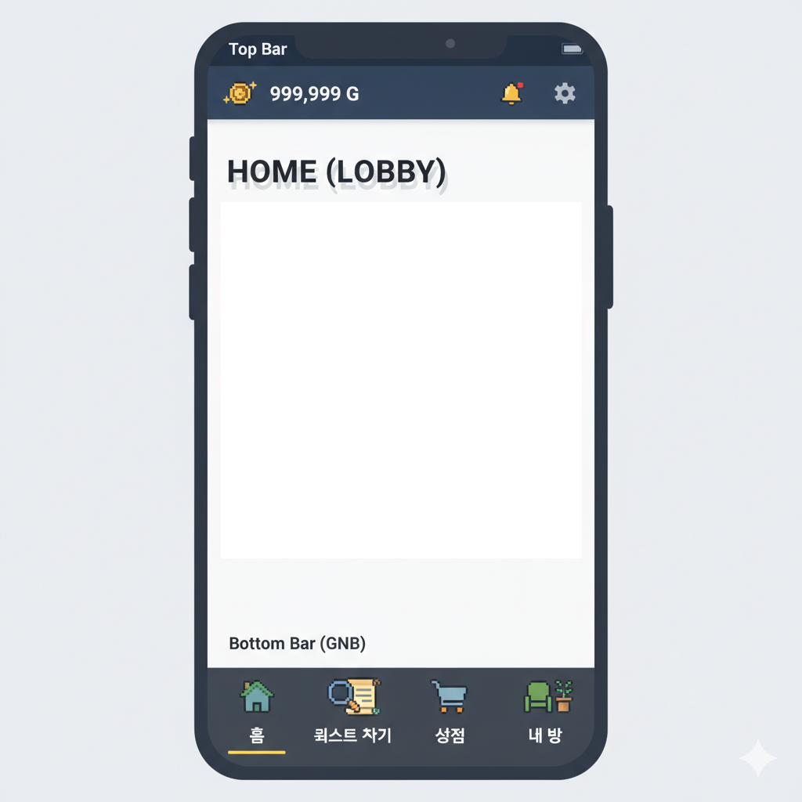
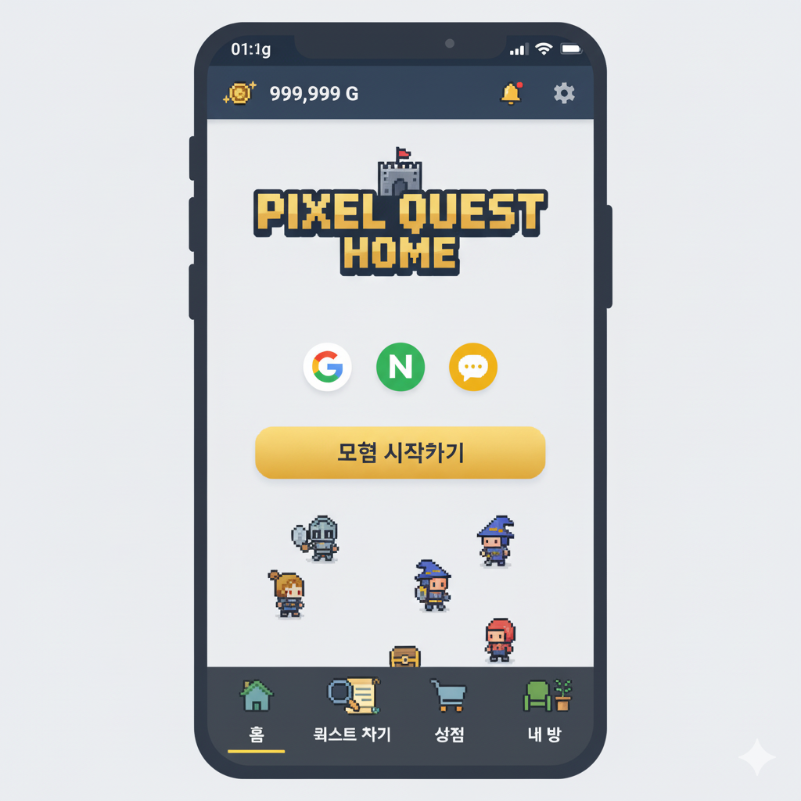
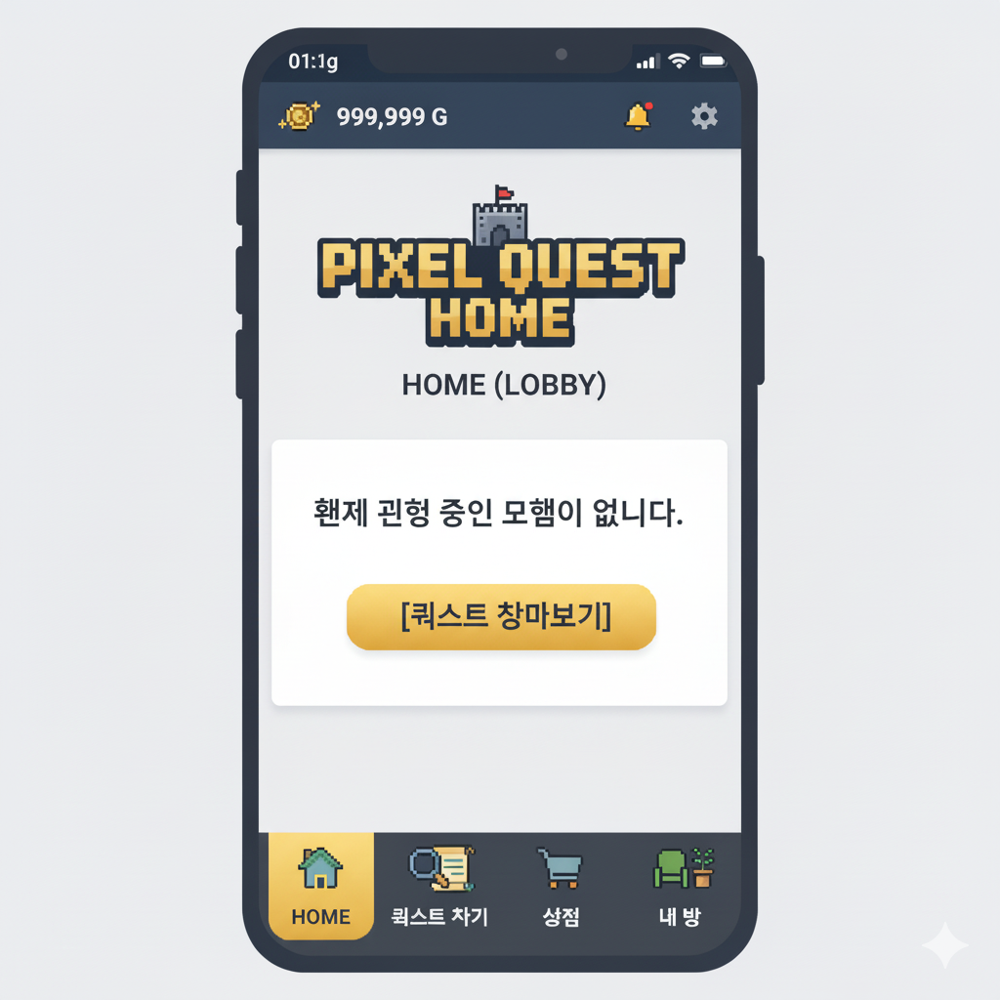
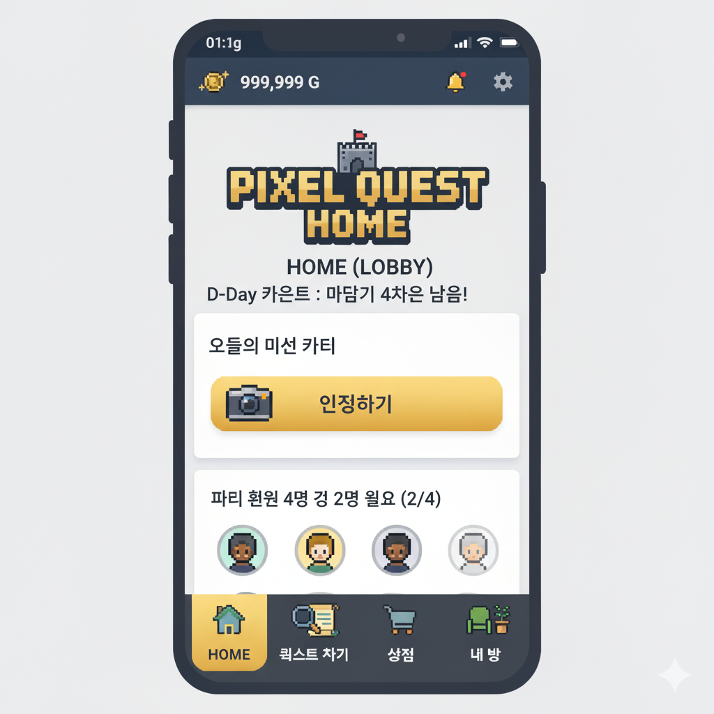
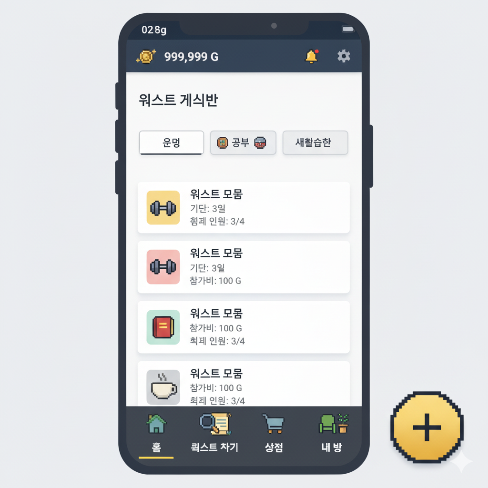
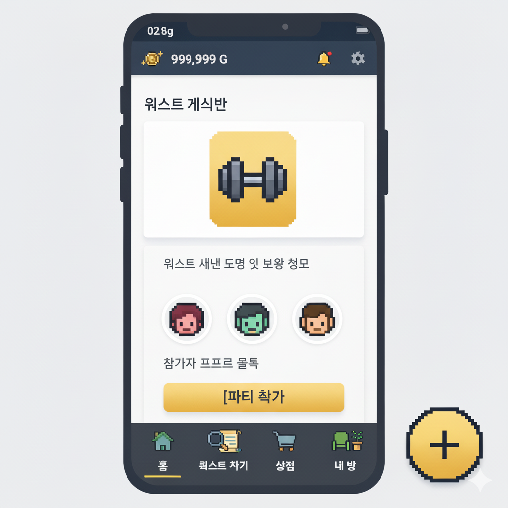
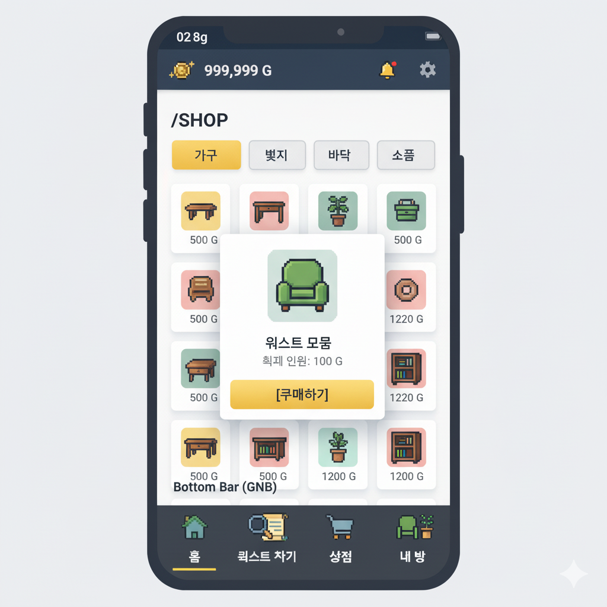
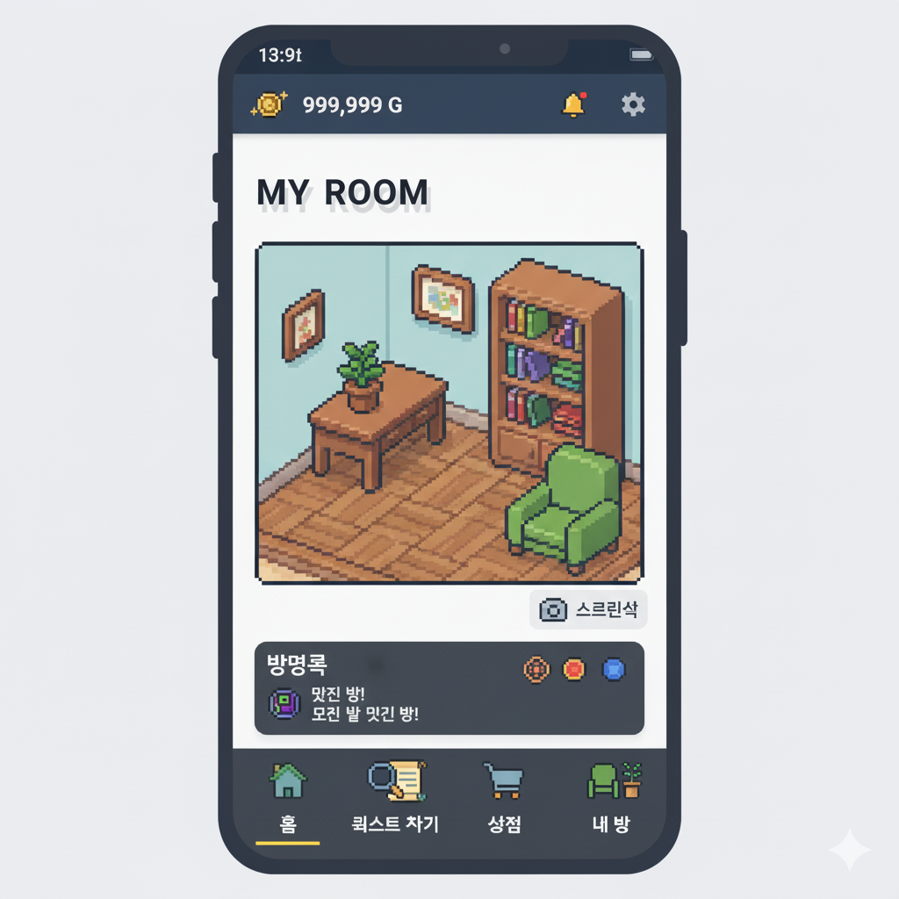
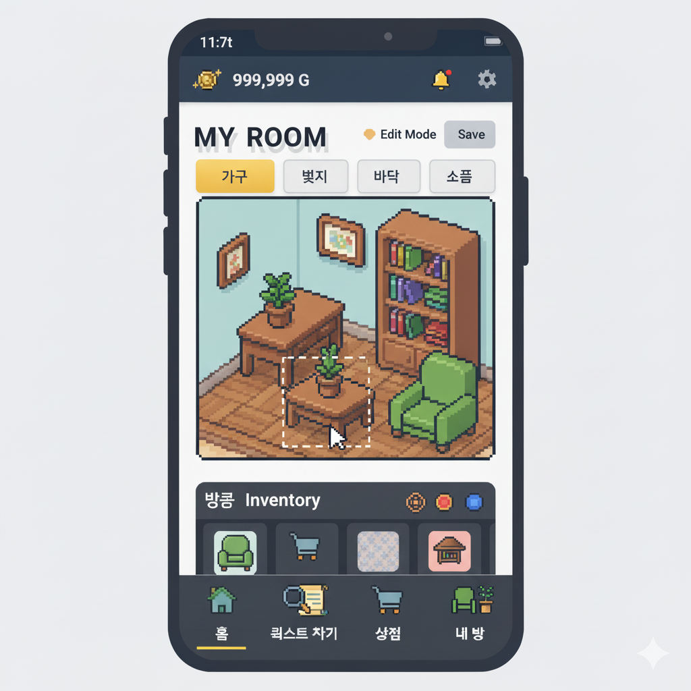

# UI 디자인 시안 (v1.0)

### 1. 뼈대

### 2. 로그인

### 3. 홈-퀘스트 없음 (Home)

### 4. 홈-퀘스트 있음 (Home)

### 5. 퀘스트리스트 (QuestList)

### 6. 퀘스트정보 (QuestInfo)

### 7. 진행중인 퀘스트 (QuestPlaying) - 4번과 동일

### 8. 상점 (Shop)

### 9. 마이룸-뷰 (Myroom)

### 9. 마이룸-에디트 (Myroom)

